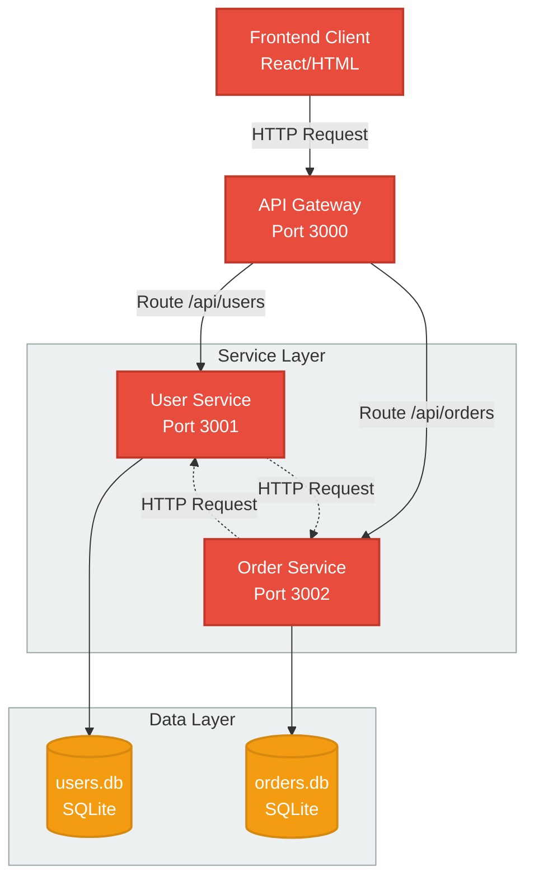

# Food Delivery System - Microservices Architecture

## Project Overview
Food Delivery System adalah aplikasi pengiriman makanan yang dibangun dengan arsitektur microservices menggunakan Node.js, Express, dan SQLite Database.

---

## Struktur Sistem



---

## Komponen Utama

### 1. **Frontend Client**
   - Interface pengguna untuk Food Delivery System
   - Menampilkan daftar pengguna, pesanan, dan form pembuatan pesanan
   - Berkomunikasi melalui API Gateway

### 2. **API Gateway** (Port: 3000)
   - Pintu masuk tunggal untuk semua request dari client
   - Routing request ke service yang sesuai
   - Dokumentasi API dengan Swagger/OpenAPI

### 3. **User Service** (Port: 3001)
   - Mengelola data pengguna
   - Fungsi: Create, Read, Update, Delete users
   - Database: `users.db` (SQLite)
   - Endpoints: `/api/users`

### 4. **Order Service** (Port: 3002)
   - Mengelola data pesanan makanan
   - Fungsi: Create, Read, Update, Delete orders
   - Integrasi dengan User Service untuk fetch user details
   - Database: `orders.db` (SQLite)
   - Endpoints: `/api/orders`

### 5. **Database Layer**
   - **users.db**: Menyimpan informasi pengguna (SQLite)
   - **orders.db**: Menyimpan informasi pesanan (SQLite)

---

## Communication Flow

### User Management Flow
```
Client → API Gateway → User Service → SQLite (users.db)
```

### Order Management Flow
```
Client → API Gateway → Order Service → SQLite (orders.db)
         ↓
      User Service (untuk validasi user)
```

### Create Order with User Details
```
Client → API Gateway → Order Service 
         ↓
      User Service (fetch user info)
         ↓
      SQLite (orders.db + users.db)
```

---

## Teknologi yang Digunakan

| Komponen | Teknologi |
|----------|-----------|
| **Backend** | Node.js, Express.js |
| **Database** | SQLite3 |
| **API Documentation** | Swagger UI / OpenAPI |
| **HTTP Client** | Axios |
| **Task Runner** | Concurrently, Nodemon |
| **Frontend** | HTML5, CSS3, Vanilla JavaScript |

---

## Struktur Folder

```
food_deliv/
├── api-gateway/
│   └── server.js          # API Gateway utama
├── user-service/
│   ├── server.js          # User Service
│   └── database/
│       └── users.db       # Database pengguna
├── order-service/
│   ├── server.js          # Order Service
│   └── database/
│       └── orders.db      # Database pesanan
├── frontend/
│   └── index.html         # Frontend aplikasi
├── database/              # Shared database directory
├── package.json           # Dependencies
├── start-all.bat          # Script untuk menjalankan semua services
└── README.md              # Dokumentasi
```

---

## Ports Configuration

| Service | Port | URL |
|---------|------|-----|
| **API Gateway** | 3000 | `http://localhost:3000` |
| **User Service** | 3001 | `http://localhost:3001` |
| **Order Service** | 3002 | `http://localhost:3002` |
| **Frontend** | Static | Via API Gateway |


---

## API Endpoints

### User Service Endpoints
- `GET /api/users` - Get all users
- `POST /api/users` - Create new user
- `GET /api/users/:id` - Get user by ID
- `PUT /api/users/:id` - Update user
- `DELETE /api/users/:id` - Delete user

### Order Service Endpoints
- `GET /api/orders` - Get all orders
- `POST /api/orders` - Create new order
- `GET /api/orders/:id` - Get order by ID
- `GET /api/orders/:id/with-user` - Get order with user details
- `PUT /api/orders/:id` - Update order status

## Dokumentasi Postman : https://drive.google.com/drive/folders/18WuKyIpysC8GErhIrZ7g1Pi7SJ4-fEdm?usp=sharing

---